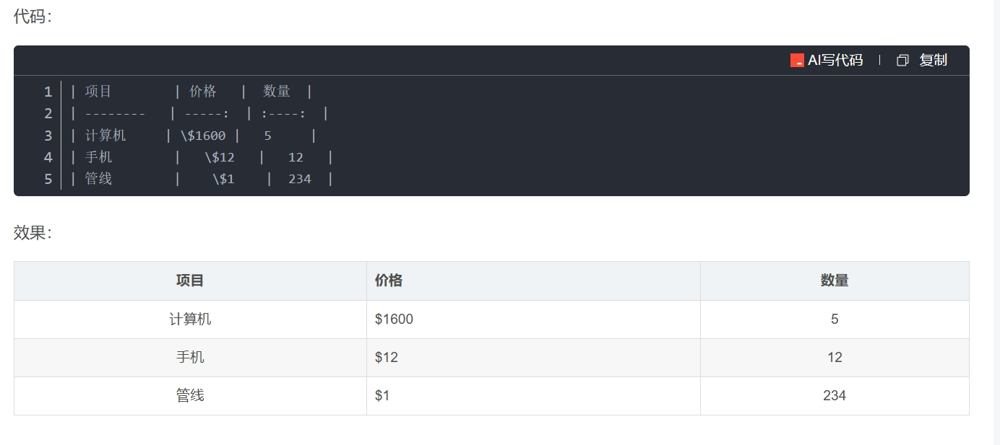

# 文本修饰

### 标题

#一级标题

##二级标题

...

######六级标题

（中间要加空格）

> ctrl+n(1,2,3)

### 斜体

\*斜体\*

> Ctrl+I


### 粗体

\*\*粗体\*\*

> Ctrl+B


### 斜粗体

\*\*\*斜粗体\*\*\*


### 行内代码块

\` 行内代码块\`


### 字体颜色

详情见Autohotkey

> Alt+1:<font color='red'>红色</font>
>
> Alt+2:<font color='blue'>蓝色</font>
>
> Alt+3:<font color='DAA520'>黄色</font>


### 分割线

\*\*\*

# 列表

列表分为无序列表和有序列表

* 无序列表，使用 `*`、 `+` 、`-` ，再加一个空格作为列表的标记
* 有序列表，使用数字并加上`.`号，再加一个空格作为列表的标记

```
* 无序列表 1

* 无序列表 2

* 无序列表 3

1. 有序列表 1

2. 有序列表 2

3. 有序列表 3
```

列表可以嵌套 `Ctrl`+`]` 缩进


# 块

块分为代码块、引用块、警告框

### 代码块

\`\`\`语言


\`\`\`

### 引用块

\>


> 引用块中可以嵌套引用块，引用块中依然可以使用md语法

# 链接

[网站名]\(https://baidu.com)

# 图片

\![图片未显示的文本]\(url)

# 表格



**<font color='red'>Ctrl+t 一键生成表格</font>**

