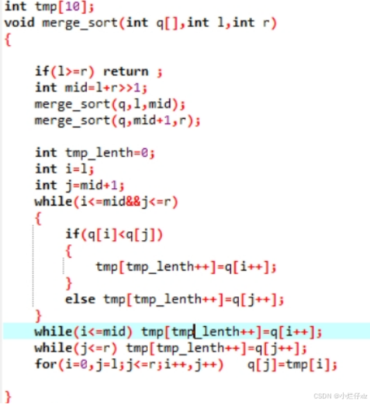

# 小技巧：

如果相对自定义数据类型排序：

```cpp
struct Node
{
	int a,b;
	bool operator<(const Node &n)const
	{
		return b<n.b;
	}

};
```


优先队列，集合和sort都适用

# 算法基础

## 排序

### 快速排序

模版：

编辑

### 归并排序

模版：

编辑

## 二分：

### 整数二分：


编辑


最大化查找：找右边界（l r l）

最小化查找：找左边界（r l r）

编辑

check函数即为阴影部分满足的函数

步骤：

​    判断是最大化还是最小化（找最大值还是最小值or 找左边界还是右边界）

​    判断函数的走势曲线，编写check函数

### 浮点二分

编辑

浮点数用整数二分的任意一个板子即可

## 前缀和

### 一维前缀和：

**递推公式：S[i]=a[i]+S[i-1];**

**求[l,r]数字和：Sum=S[r]-S[l-1];**

**其中：数组S下标从0开始，S[0]默认为0；数组a下标从1开始，故实际数组a长度为n+1；**

如果说a从0开始，那么递推公式将该为s[i]=a[i-1]+s[i-1];

### 二维前缀和：

**递推公式：S[i]\[j] = a[i]\[j]+S[i-1]\[j]+S[i]\[j-1]-S[i-1]\[j-1]**

**求（x1,y1）,(x2,y2)内的数字和：Sum=S[x2]\[y2]-S[x2]\[y1-1]-S[x1-1]\[y2]+S[x1]\[y1];**

s[i]\[j]

## 差分：

求差分和求前缀和互为逆运算：

构造数组B，使得

B[0]=a[0];

B[1]=a[1]-a[0];

B[2]=a[2]-a[1];

......

B[i]=a[i]-a[i-1];

那么a[i]=B[0]+B[1]+...+B[i];


如果对a数组全体增加c，只需B[0]+=c;

如果对a数组[l,n]增加c，只需B[l]+=c;

**如果对a数组[l,r]增加c，只需B[l]+=c;  B[r+1]-=c;**


## 双指针

编辑

## 位运算

### 一、判断n的二进制的第k位数字是几    **(k从0开始）**

​    **res=n>>k&1;**      

​    **如果想获得其二进制数直接for循环** 

例：

​    10(1010)的第三位数字-----1;

### **二、返回n的二进制的最后一位1的数字**

​    **res=x&-x;**

例：

​    101000的最后一位1为1000；


**刷题模版**：

do{

​    res+=n&1;

​    ...

}while(n>>=1);


例：求n的二进制数中的1的个数：

法一：

do{

​    res+=n&1;

}while(n>>=1);

法二：

while(n){

​    n-=（n&-n）;

​    res++;

}

法二更快；

## 离散化：

定义：将原本在连续空间中的数据映射到离散空间的过程

人话：当一组数据**值域范围很大**但是**数据个数很稀疏**，可以对其进行离散化

**<font color='red'>离散化＝排序+去重</font>**（下标即为离散化后的数据）

编辑

其中alls数组可以理解为一个映射表

find函数既可以理解为从映射表里查找；

find返回值依据题目所定

## 区间合并

定义：将多个区间合并

思路：

**①先按照左端点排序**

**②区间一共这三种情况：相容，相交，无交集**

编辑

**采用双指针解决**

对于无交集（i区间的右<j区间的左）

​    那么i区间合并完成，将其保存，并且i指向j区间；

对有交集（else）

​    i区间的end=max（i区间的end，j区间的end），

​    j向后移动一位


代码如下

```cpp
#include<bits/stdc++.h>
using namespace std;
typedef pair<int,int> PII;
int merge(vector<PII>& a){
	int i,j; 
	vector<PII> v;
	sort(a.begin(),a.end());
	for(i=0,j=i+1;j<a.size();j++)
	{
		if(a[i].second<a[j].first)//不相交 
		{
			v.push_back({a[i].first,a[i].second});
			i=j;
			continue;
		}
		else//相交，更新右端点 
			a[i].second=max(a[i].second,a[j].second);
		
	}
	v.push_back({a[i].first,a[i].second});//最后一个别忘了 
	a=v;
	return a.size();
}
int main(){
	vector<PII> a;
	int n;
	cin>>n;
	for(int i=0;i<n;i++){
		int l,r;
		cin>>l>>r;
		a.push_back({l,r});
	}
	cout<<merge(a);
	cout<<endl;
	for(int i=0;i<a.size();i++){
		cout<<a[i].first<<' '<<a[i].second<<endl;
	}
	
}
```


# 数据结构

## 静态单链表

在算法题中一般用**数组**模拟链表，速度比动态链表（new node）快很多

**e为值**，**ne为next指针**（下一个元素下标），idx为新节点的下标

定义head指针为**ne[0]**；

当ne数组的值==0,即为null;

故

初始化链表即为ne[0]=0;idx=0;

**new 等价于 idx++；**

插入删除同下

.....

```cpp
#include<iostream>
using namespace std;
const int N=10000;
int e[N],ne[N],idx;
int init()
{
	ne[0]=0;
	idx=0;
}
int insert(int k,int x){
	idx++;
	e[idx]=x;
	ne[idx]=ne[k];
	ne[k]=idx;
}
int remove(int k){
	ne[k]=ne[ne[k]];
} 
void print(){
	int i=0;
	while(ne[i]){
		cout<<e[ne[i]]<<' ';
		i=ne[i];
	}
}
int main(){
	init();
	insert(0,1);
	insert(idx,4);
	insert(idx,8);
	insert(0,3);
	remove(2); 
	print();
	
}
```


## 单调栈

编辑

优化思路：若出现存在前大于后的情况，那么必定不会成为后续元素的答案，可以删除；

思路：入栈前比较与栈顶元素的大小：

若大于栈顶：输出栈顶的值并入栈

若小于栈顶：则将栈顶弹出，直到大于栈顶（输出栈顶的值）或者栈空（输出-1）；

## 单调队列（滑动窗口）

编辑

优化：和单调栈类似，只不过多了一个头删的操作，所以用到双端队列（栈和队列的结合体）

思路（求最大值）：入队前和队尾比较大小，若小于队尾，入队；若大于，弹出队尾，继续比较...

直到入队。入队后要检查是否要弹出队首。最后输出队首即可

```cpp
#include<iostream>
#include<deque>
using namespace std;
int main()
{
    deque<int> q;
    int n,k;
    cin>>n>>k;
    int a[n];
    for(int i=0;i<n;i++){
        scanf("%d",a+i);
    }
    for(int i=0;i<n;i++)
    {
        while(q.size()&&q.back()>a[i]) q.pop_back();
        if(i>=k&&a[i-k]==q.front()) q.pop_front();
        q.push_back(a[i]);
        if(i>=k-1) printf("%d ",q.front());
    }
    cout<<endl;
    while(q.size()) q.pop_back();
    for(int i=0;i<n;i++)
    {
        while(q.size()&&q.back()<a[i]) q.pop_back();
        q.push_back(a[i]);
        if(i>=k&&a[i-k]==q.front()) q.pop_front();
        if(i>=k-1) printf("%d ",q.front());
    }
   
    
}
```


## 字典树（Trie树）

编辑

```cpp
#include<iostream>
#include<string>
using namespace std;
const int N=100010;
int son[N][26],cnt[N],idx;
void insert(string str){
	int p=0;
	for(int i=0;i<str.length();i++){
		int u=str[i]-'a';
		if(son[p][u]==0) {
			idx++;
			son[p][u]=idx;
		}
		p=son[p][u];
	}
	cnt[p]++;
	
} 
int query(string str){
	int p=0;
	for(int i=0;i<str.length();i++){
		int u=str[i]-'a';
		if(son[p][u]==0)return 0;
		else p=son[p][u];
	}
	return cnt[p];
}
int main(){
	string str;
	while(str!="-1"){
		cin>>str;
		if(str!="-1")insert(str); 
	}
	
	while(str!="-2"){
		cin>>str;
		if(query(str)) cout<<"yes"<<endl;
		else cout<<"NO"<<endl;
	}
}
```


**son数组：**

【26】对应26个字母，若**有值**，说明有该**节点存在**，若为0，则表示不存在

值：里面的值**存储的是下一个节点的地址**（idx），类似于静态链表

**cnt数组：**

cnt[i]表示：以i位置下的节点为**结尾**的单词数量，也就是上图的**五角星**数量，若为0，说明并不存在以该字母为结尾的单词

**p变量：**

一个自由指针，**p=son[p]\[u]**实现了在树上的移动


## 并查集

编辑

其中问题2时间过于复杂，可以对其**压缩优化**

编辑

即**在寻找根节点的过程中，将路径上的所有节点的父节点都指向根节点**

```cpp
#include<iostream>
using namespace std;
const int N=20010;
int p[N];        //p[i]表示i节点的父节点
int find(int x)        //根节点
{
    if(p[x]!=x) 
        p[x]=find(p[x]);    //压缩优化
    return p[x];
}

int main()
{
    int n,m;
    cin>>n>>m;
    for(int i=0;i<n;i++)    //初始化，所有元素的集合只有自己（p[x]==x表示该节点为根节点）
        p[i]=i;
    for(int i=0;i<m;i++)    //合并集合
    {
        int x,y;
        scanf("%d%d",&x,&y);
        p[find(x)]=find(y);    //让根节点的父节点等于另一个的根节点，实现合并
    }
    int q;
    cin>>q;
    for(int i=0;i<q;i++)    //判断是否在一个集合
    {
        int x,y;
        scanf("%d%d",&x,&y);
        if(find(x)==find(y))    //判断是否是一个根节点
            puts("Yes");
        else
            puts("No");
    }
}
```


其中关键点有三个：

①初始化：p[i]=i;    很容易忘记的步骤

②find函数：用于**查找根节点**，其中**p[x]=find(p[x])**实现了压缩优化，模版代码必须背下来

③合并：**p[find(x)]=find[y];**(find为根节点，p为父节点，故该语句实现的是**让根节点的父节点等于另一个节点的根节点**）

## 线段树

编辑

编辑

编辑

编辑

查询和更新都是logn

```cpp
#include<bits/stdc++.h>
using namespace std;
#define lc root<<1
#define rc root<<1|1
const int N =100;
int w[10]={1,1,5,3,2,6,98,56,4,10};

struct Node
{
	int l,r,sum;
}tr[N*4];
void build(int root,int l,int r)
{
	if(l==r)
	{
		tr[root]={l,r,w[l]};
		return ;
	}
	else
	{
		int mid=l+r>>1;
		build(lc,l,mid);
		build(rc,mid+1,r);
		tr[root]={l,r,tr[lc].sum+tr[rc].sum};
	}
}
int query(int  root,int x,int y)
{
	if(x<=tr[root].l&&y>=tr[root].r)
		return tr[root].sum;
	else
	{
		int sum=0;
		int mid=tr[root].l+tr[root].r>>1;
		if(x<=mid) sum+=query(lc,x,y);
		if(y>mid) sum+=query(rc,x,y);
		return sum;
	}
}
void update(int root,int x,int k)
{
	if(x==tr[root].l&&x==tr[root].r)
	{
		tr[root].sum+=k;
		return ;
	}
	else
	{
		int mid=tr[root].l+tr[root].r>>1;
		if(x<=mid) update(lc,x,k);
		if(x>mid) update(rc,x,k);
		tr[root].sum=tr[lc].sum+tr[rc].sum;
	}
}
int m
```


# 数论


##    质数

### 质数判断

到sqrt(n)即可

```cpp
bool is_prime(int n)
{
	if(n<2) return 0;
	for(int i=2;i<=n/i;i++)
	{
		if(n%i==0)
			return 0;
	}
	return 1;
}
```


### 分解质因数

定理：数字n中最多有一个大于sqrt(n)的质因数（因为如果有两个的话，相乘大于n了）

```cpp
void divide(int n)
{
	for(int i=2;i<=n/i;i++)
	{
		if(n%i==0)//此时i一定是质数 
		{
			int s=0;
			while(n%i==0)//把该质数的倍数全部消掉，保证了每次i都是质数（埃氏筛） 
			{
				n/=i;
				s++;
			}
			cout<<i<<' '<<s<<endl;
		}
	}
	if(n>1)//大于sqrt(n)的那个质因数 
		cout<<n<<' '<<1<<endl;
}
```


### 筛质数

求1~n区间上的质数

#### 埃氏筛

```cpp
void get_primes(int n)
{
	for(int i=2;i<=n;i++)
	{
		if(!st[i])
		{
			primes.push_back(i);
			for(int j=2*i;j<=n;j+=i) st[j]=1;
		}
	}
}
```


接近于线性但不是

#### 欧拉筛

编辑

线性

## 约数

### 求约数

```cpp
vector<int> get_divisors(int n)
{
	vector<int> res;
	for(int i=1;i<=n/i;i++)
	{
		if(n%i==0)
		{
			res.push_back(i);
			if(i!=n/i) res.push_back(n/i);
		}
	}
	sort(res.begin(),res.end());
	return res;
}
```


若n可以整除d，那么n也可以整除n/d；

所以只需要枚举d和n/d中较小的那一个，故**遍历到sqrt（n）即可**

记得判断d和n/d是否相同

### 求约数的个数

编辑

算数基本定理得：每个数可以唯一的分解成质因数的乘积

> 
>
> 
>
> 

可得

所以有种取法

**所以总共有个约数**


### **求约数的和**

编辑运用等比数列求和公式即可：

这两道题的基础都是[分解质因数](#分解质因数)

### 求最大公约数

前提定理：

![a \bmod b=a-\left [\frac{a}{b} \right ]\times b](./img/times%20b.png);

%253Da.png)

.png)

```cpp
int gcd(int a,int b)
{
	return b?gcd(b,a%b):a;
}
```


## 欧拉函数

**互质的定义:**


（1和所有数互质）

**欧拉函数定义：**

%253D.png)1~N中与N互质的个数

### 求一个数的欧拉函数

算数基本定理得：


欧拉函数：.png)

```cpp
int main()//求分解质因数的改版
{
	int n;
	cin>>n;
	int res=n;
	for(int i=2;i<=n/i;i++)
	{
		if(n%i==0)
		{
			while(n%i==0) n/=i;
			res*=(1-1/(double)i);
		}
	}
	if(n>1)
		res*=(1-1/(double)n);
	cout<<res;
}
```


### 求区间内所有数的欧拉函数

暂时不理解（acwing 数学二 22:12 ）

## 快速幂


当a和k很大时，正常做法复杂度是o(k)即循环k次 res=res*a%p;

快速幂求法是先求出

然后用这些值合成(二进制）

编辑

# 搜索和图论


### 全排列问题（DFS）

编辑

**DFS(u)的含义是从第u个开始深度优先搜索’；**

**DFS函数体的内完成的代码如下：**

**判断是否已经找到一个解，若是则输出答案**

**否则：**

**①在第u个位置寻找所有可选元素，并记录or标记该元素**

**②DFS下一个位置（DFS（u+1））**

**③恢复现场：将记录or标记恢复；**


求解全排列问题的关键点：

构造path数组保存当前序列

构造st数组记录是否已被选过（上层），for循环保证了兄弟节点不会重复

**恢复现场**：递归调用结束完要将递归调用前的变化调整回去

```cpp
#include<bits/stdc++.h>
using namespace std;
int n;
int path[100];
bool st[100];
void dfs(int u)
{
	if(n==u)
	{
		for(int i=0;i<n;i++) 
			cout<<path[i];
		cout<<endl;
	}
	for(int i=1;i<=n;i++)
	{
		if(!st[i]){
			path[u]=i;
			st[i]=true;
			dfs(u+1);
			st[i]=false;//恢复现场
		}
	}
} 
int main()
{
	cin>>n;
	dfs(0);
	
}
```


### N皇后问题（DFS)

编辑

按照上一个题步骤同理可得如下代码

```cpp
#include<bits/stdc++.h>
using namespace std;
int n;
int path[100];
bool st1[100],st2[100],st3[100];//列，对角线和反对角线 
void dfs(int u)
{
	if(n==u)
	{
		for(int i=0;i<n;i++)
		{
			for(int j=0;j<n;j++)
			{
				if(path[i]==j)cout<<'Q'<<' ';
				else cout<<"_ "; 
			}
			cout<<endl;
		}
		cout<<endl;
	}
	for(int i=0;i<n;i++)
	{
		if(!st1[i]&&!st2[i+u]&&!st3[n-i+u])
		{
			path[u]=i;
			st1[i]=st2[i+u]=st3[n-i+u]=1;
			dfs(u+1);
			st1[i]=st2[i+u]=st3[n-i+u]=0;
		}
	}
	
} 
int main()
{
	cin>>n;
	dfs(0);
	
}
```


第二种思路：遍历每一个位置：都有两种选择，选和不选

编辑

当枚举至最后一个格子或者找到最后一个皇后程序结束

```cpp
#include<bits/stdc++.h>
using namespace std;
int n;
int path[100];
bool st1[100],st2[100],st3[100],st4[100];//行、列，对角线和反对角线 
void dfs(int x,int y,int u)
{
	
	if(n==u)
	{
		for(int i=0;i<n;i++)
		{
			for(int j=0;j<n;j++)
			{
				if(path[i]==j)cout<<'Q'<<' ';
				else cout<<"_ "; 
			}
			cout<<endl;
		}
		cout<<endl;
	}
	//边界调整 
	if(y==n) 
		x++,y=0;
	if(x==n) 
		return;
		
	//当前位置不放
	dfs(x,y+1,u);
	
	//当前位置放
	if(!st1[x]&&!st2[y]&&!st3[x+y]&&!st4[n-x+y]){
		st1[x]=st2[y]=st3[x+y]=st4[n-x+y]=1;
		path[u]=y;
		dfs(x,y+1,u+1);
		st1[x]=st2[y]=st3[x+y]=st4[n-x+y]=0;
		
		
	} 
	
	
} 
int main()
{
	cin>>n;
	dfs(0,0,0);
	
}
```


### BFS


**思路：**

**初始节点入队**

**while q不空**

**{**

​    **将队首的可扩展元素入队**

​    **队首出队**

**}**


**其中若想统计最小值，可开一个二维数组记录每一个位置的最短路径**

**若想找出最短路径，可开一个二维数组记录每一个位置的前驱位置（回溯）**


### **图**


####  **图的存储**

编辑

无向图就是特殊的有向图（双向图），一般用邻接表存储（**二维vector**或者多个单链表）

稠密图用邻接矩阵，稀疏图用邻接表

### 拓扑排序

编辑


其中d数组记录每个点的入度，当入度为0，入队，然后让队首的出度元素的入度-1（相当于删除了队首）

### 最短路

编辑

#### 朴素Dijkstra算法:

适用于**稠密图**，故使用**邻接矩阵**存储图

编辑

分为三步：

**①初始化**：

1、先将邻接矩阵初始化为无穷，然后再输入权值

2、现将dist数组初始化为无穷，然后将起点赋为0；（无穷最好不要是0x7fff，因为有可能出现两个无穷相加，从而导致溢出）

**②加点：****没有确定最短路的点**（st数组为0）且**距离最小**的点，可以加入该点（st=1），使其变成确定最短路的点

**③更新：**根据新加的点，更新到每个点的最短路径

②③步循环n-1次（n为节点数）

```cpp
#include <bits/stdc++.h>
using namespace std;
const int N=6100;
const int inf=0x3f3f3f3f;
int n,m;
int g[N][N];
int dist[N];
bool st[N];
void dijkstra();
int main() {
    cin>>n>>m;
    memset(g,0x3f,sizeof g);
    memset(dist,0x3f,sizeof dist);
    for(int i=0;i<m;i++)
    {
        int a,b,c;
        cin>>a;
        cin>>b;
        cin>>c;
        g[a][b]=c;
        g[b][a]=c;
    }
    dijkstra();
    cout<<(dist[n]!=inf?dist[n]:-1); 
}
void dijkstra()
{
    dist[1]=0;
    for(int i=0;i<n-1;i++)
    {
        int t=-1;
        for(int j=1;j<=n;j++)
        {
            
            if(!st[j]&&(t==-1||dist[t]>dist[j]))
            {
                t=j;
            }
        }
            st[t]=1;
        for(int j=1;j<=n;j++)
        {
          dist[j]=min(dist[j],dist[t]+g[t][j]);
        }
        
    }
}
// 64 位输出请用 printf("%lld")
```


代码解释：

dist数组存放的是起点到各个点的最短距离，st数组表示该点已经确定了是最短的的距离，g是矩阵


### 最小生成树

编辑

#### 朴素Prim

与dikjstra算法类似，但有不同：

​    dist：是**生成树**到该点的距离

​    st：是否在**生成树**内

​    总循环是**n**次而不是n-1次

​    加点的同时还要**res+=dist[t]**

​    更新点的时候是**g[t][j]**而不是dist[t]+g[t][j]；


代码思路：

①初始化：

与dijkstra完全相同，dist初始为inf，dist[0]=0;(这里其实换成别的点也可以）

②加点，找到离生成树最近的点，并加入生成树内，并且统计（st[t]=true; res+=dist[t]），记得判断是否dist[t]==inf,如果是那么直接退出说明不联通无法建树

③更新dist


```cpp
#include<bits/stdc++.h>
using namespace std;
const int N =10010;
const int inf=0x3f3f3f3f;
int n,m;
int g[N][N];
int dist[N];
bool st[N];
int Prim()
{
	int res=0;
	dist[1]=0;
	for(int i=0;i<n;i++)//区别于dijkstra，这里是n次 
	{
		int t=-1;
		for(int j=1;j<=n;j++)
		{
			if(!st[j]&&(t==-1||dist[t]>dist[j]))//这里是或！！！ 
			{
				t=j;
			}
		}
		if(dist[t]==inf) return -1;//如果找出的最短距离是inf说明无路可走，无法建立生成树 
		st[t]=1;
		res+=dist[t];//加点并记录生成树的权值，对于dijkstra多了一个res 
		for(int j=1;j<=n;j++)
		{
			dist[j]=min(dist[j],g[t][j]);//dijkstra这里是dist[t]+g[t][j]，与其不同 
		}
	}

	return res;
}
int main()
{
	cin>>n>>m;
	memset(g,0x3f,sizeof g);
	memset(dist,0x3f,sizeof dist);
	for(int i=0;i<m;i++)
	{
		int a,b,c;
		cin>>a>>b>>c;
		g[a][b]=g[b][a]=min(g[a][b],c);
	}
	cout<<Prim();
}
```


# 动态规划：


### 计数问题：


思路：统计每一位出现数字的次数，求和

对于数字x不为0的情况下，求法如下：

编辑

**当数字x为0，则第一种情况xxx=001~abc-1，数量为（abc-1）\*1000；**

```cpp
#include<iostream>
#include<vector>
using namespace std;
int getNum(vector<int> &a,int left,int right){
	int res=0;
	for(int i=right;i>=left;i--){
		res*=10;
		res+=a[i];	
	}
	return res;	
} 
int power10(int x){
	int res=1;
	while(x--) res*=10;
	return res;
}
int count(int n,int x){
	if(n==0) return 0;
	vector<int> num;
	int res=0;
	while(n>0){
		num.push_back(n%10);
		n/=10;
	}
	for(int i=0;i<num.size();i++){
		res+=getNum(num,i+1,num.size()-1)*power10(i);
		if(x==0) res-=power10(i);//当数字为0时
		if(num[i]>x) res+=power10(i);
		else if(num[i]==x) res+=getNum(num,0,i-1)+1;
	}
	return res;
}
int main(){
	int x1, x2;
	cin>>x1>>x2;
	for(int i=0;i<10;i++)
		cout<<(count(x2,i)-count(x1-1,i))<<' ';
}
```


如果不是从0开始，只需相减即可

### 蒙德里安的梦想（状态压缩dp）

```cpp
#include<cstring>
#include<iostream>
using namespace std;
const int N=10000,M=10000;
int n,m;
bool judge(int x){
	int cnt=0;
	for(int i=0;i<n;i++){
		if(x&1)
			if(cnt%2==1) return 0;
			else cnt=0;
		else cnt++;
		x/=10;
	}
	return cnt%2==0;
} 
int dp[N][M];
int f(int i,int j){
	if(i==0) return !j;
	if(dp[i][j]!=-1) return dp[i][j];
	int res=0;
	for(int k=0;k<(1<<n);k++){
		if((j&k)==0&&judge(j|k)){
			res+=f(i-1,k);
		}
	}
	return dp[i][j]=res;
}
int main(){
	memset(dp,-1,sizeof(dp));
	dp[0][0]=1;
	cin>>n>>m;
	cout<<f(m,0);
}
```

